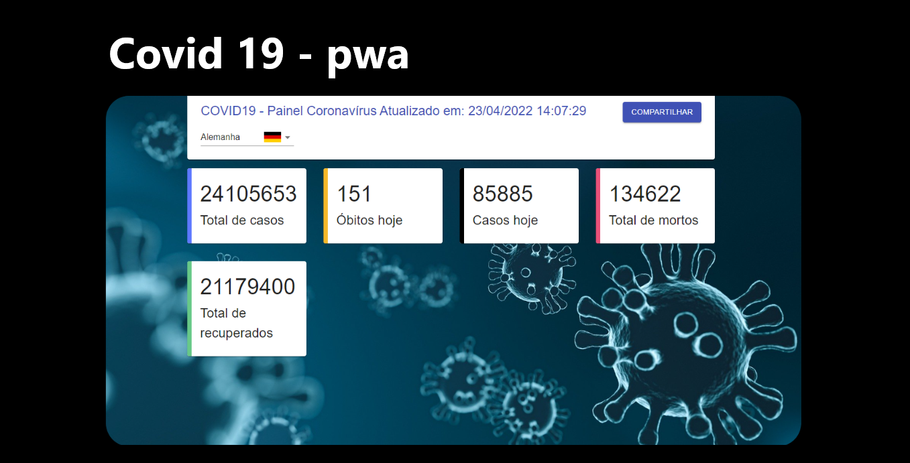

  

## 💻 Projeto

O projeto Covid-19-pwa é uma PWA (Progressive Web Aplication) que, por meio do consumo de uma API, permite que o usuário acesse aos principais dados com releção à pandemia, pelo mundo. Tais dados são dispostos em cards, separadamente, distribuídos em um dashboard. Há também um painel onde o usuários poderá escolher o país do qual desejada ver os dados, referente á covid 19, como: número de casos e número de mortos.

Para visualizar o preview do projeto acesse o [link](https://covid-19-pwa.herokuapp.com/).

## 🚀 Tecnologias

Este projeto foi desenvolvido com as seguintes tecnologias:
- ReactJS;
- JavaScript;
- Styled-Components;
- Materiral UI;
- Yarn.
